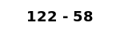

# captcha-microservice
REST based captcha generating microservice

Consists of the following types:
- Image To Text
  
  
  
  (Ans: dfl22V)
  
- Math Challenge

  
  
  (Ans: 64)

## Workflow
- Request captcha using one of the methods
- Response body is the raw body of the captcha (image/sound) and Captcha Id will be provided in `X-Captcha-Session-Id` header
- Answer can be verified using the `/verify` endpoint providing a JWT token
- JWT token can be used to confirm authenticity on server side or client side with `/verify` endpoint
## **Methods**

## Random Captcha
## `/captcha/captcha`

Get a random captcha from all the methods supported

Header: `X-Captcha-Session-Id` - contains the captcha id

Body is raw content of the captcha (image/sound)

## Image Captcha
## `/captcha/imageCaptcha`

Get image captcha

Header: `X-Captcha-Session-Id` - contains the captcha id

Body is raw image in png format


## Math Captcha
## `/captcha/mathCaptcha`

Get math challenge which gives a math equation

Header: `X-Captcha-Session-Id` - contains the captcha id

Body is raw image in png format


## Verify
## `/verify?sessionId=<captchaId>&solution=<solution>`

Verify captcha answer. A JWT token is returned if the answer is correct (`200` status code), else `401` status code is returned

## Validate
## `/validate?sessionId=<captchaId>&token=<token>`

Can be used server side to validate the verification

# **Usage**

## As a service
## *Environment Variables*
```
PORT=                   Application port
JWT_SECRET=             JWT signing secret
HOST=                   Hostname to use in JWT token
PROMETHEUS_SECRET=      Prometheus secret (Use with header
                        Authorization: Bearer <PROMETHEUS_SECRET>)
RATE_LIMIT_DURATION=    Rate limit duration in seconds
RATE_LIMIT_POINTS=      Rate limit points for given duration
REDIS_HOST=             Redis host
REDIS_PORT=             Redis port
REDIS_PASSWORD=         Redis password
REDIS_DB=               Redis database
REDIS_USERNAME=         Redis username
CAPTCHA_TIMEOUT=        Captcha timeout in seconds
```

## Docker
`docker run -d --name captcha-microservice --env-file app.env -p 5555:5555 crossphoton/captcha-microservice:v1.0.0`

## Kubernetes
There are 4 components to deploy:
- [Redis](./manifest/redis.yml) - For session id to solution  mapping
- [Secrets](./manifest/secrets.yml) - For configuration
- [Captcha Microservice](./manifest/captcha-microservice.yml) - The main service
- [Ingress](./manifest/ingress.yml) - For exposing the service
  
> For ingress make sure that ingress is configured. (Use [nginx ingress](https://kubernetes.github.io/ingress-nginx/) for digital ocean)

## Locally
1. Clone repository
2. Run `npm install`
3. Run `dotenv -e app.env -- npm start`

## Additional Parts
- **Prometheus** : `/metrics` endpoint with proper authorization can be used to collect metrics
- **Logging** : is done using [winston](https://www.npmjs.com/package/winston).
- **Shutdown management** : done using [lightship](https://www.npmjs.com/package/lightship)


## License
MIT License
